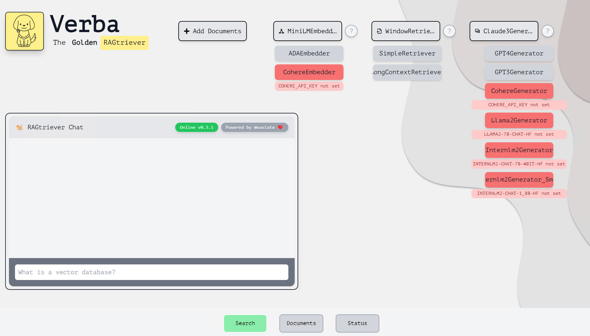
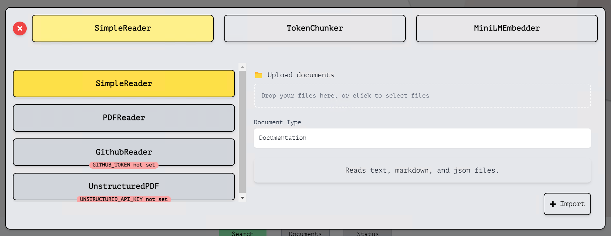
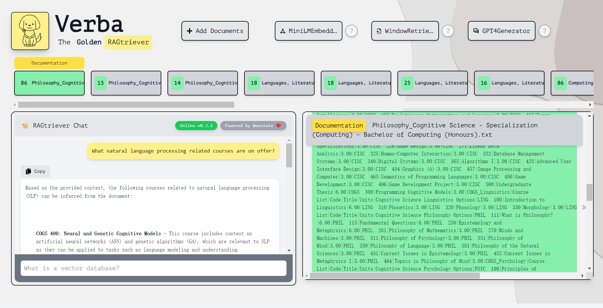
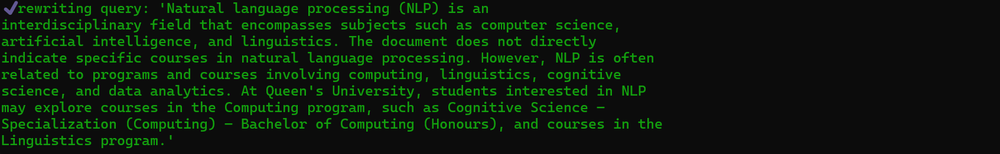
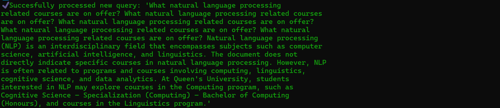
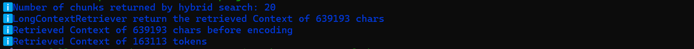
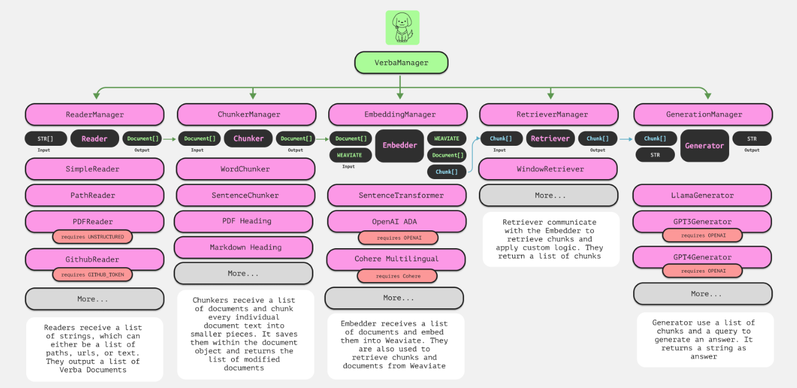

This project adds query rewriting and long text support to verba. However, the code structure, front-end interface is still the same as verba, and the way of running is also the same.

Here, the main operation guides and modifications to the code modules relative to verba are presented.

## Operation Guide

### QuickStart

Since this project is a modification of the verba source code, you can actually refer to the verba readme for a local source code based build to run this project. The next guide is also enough for you to build this project.

#### Environments
Please use macOS/Linux to build this project, if you are using windows. This is not because we have added components that are not windows compatible, it is inherent to verba. But don't worry, the wsl based Linux subsystem is also supported!

#### Build from Sourse
You should perform the next steps in the project root directory:

1. Initialize a new Python Environment and activate it 
    ```
    python3 -m virtualenv venv
    source venv/bin/activate
    ```

2. Install this project
   ```
    pip install -e .
    ```
3. Launch this project
   ```
   verba start
   ```
4. Access Verba frontend interface
    ```
    Visit localhost:8000
    ```
5. Create .env file and add environment variables, the api key should be added in.
    ``` 
    OPENAI_API_KEY=
    HF_TOKEN=
    ANTHROPIC_API_KEY = 
    INTERNLM2-CHAT-7B-4BIT-HF = False
    INTERNLM2-CHAT-1_8B-HF = False
    LLAMA2-CHAT-7B-HF = False
    ```
    If you don't use INTERNLM2-CHAT or LLAMA2-CHAT, set them to False, which determines whether or not the programme will automatically download the relevant model files or packages for you.


#### Basic Interface Introduction
Enter the front-end interface, The `Search` interface provides an    `Add documents` button, as well as a choice of `Embedder`, `Retriever` and `Generator`.



 - Emberdder
   - MiniLMEmbedder (run locally)
   - AdaEmbedder (OpenAI's ADA api)
 - Retriver
   - SimpleRetriver
   - WindowRetriever
   - LongContextRetriever (new feature, designed for LLMs with more than 100k contexts)
 - Generator
   - GPT3Generator
   - GPT4Generator
   - CohereGenerator
   - Llama2Generator
   - Internlm2Generator (new feature, run locally)
   - Internlm2Generator_Small (new feature, run locally)
   - Claude3Generator (new feature, Claude haiku api)

#### How to add documents into Verba

1. Initiate the Import Process
   - Click on "Add Documents" to begin.
2. Select Reader, Chunker, Embedder
   
   To match the Queen's University Academic Programmes database, the following configuration is recommended:
   - SimpleReader
   - TokenChunk, Units 5000, Overlap50
   - MiniLMEmbedder

#### Start query
Once you have added the documents, you can start the query in the  `SEARCH` screen!


### How to execute a query with query rewriting

In fact, each query is first sent to the query rewriting LLM for query rewriting, and we have crafted a prompt for this process to ensure that the query rewriting LLM provides valid rewritten queries, and then the original query and the rewritten query are sent back to the retriever, and the original query, along with the retrieved content, is then sent to the dialogue generating LLM, which generates a dialogue response that is sent to the front-end.

That is, the rewriting process is transparent to the front-end user, but the front-end is enhanced with query rewriting for each query.

If you want to see how query rewriting LLM handles your query, you can check it out on the backend:

1. Original query received

2. Perform query rewriting

3. Original query with rewritten query for concat, input to retriever


The text content returned by the retriever is then sent to the dialogue generator LLM along with the original query.

### How to execute a long context query
In fact, to avoid exceeding the input length limit for LLMs, and for api expense reasons, for LLMs other than Claude3, there is a limit on the length of the text input to LLMs, which will be truncated according to the importance score.

To use the long context feature, use LongContextRetriever and Claude3Generator, and use a larger chunk division (such as the tokenchunker configuration recommended earlier)

On the back-end, it prints the length of the context output by the retriever (this value is different depending on how the query matches the text, due to weaviate's hybrid retrieval strategy), as well as the length of the text entered into the dialogue-generating LLM, which can help you to better control the long context query:

In this example, the backend shows that LongContextRetriever retrieved the 20 most relevant chunks, and then spliced them according to the rules to get 639k chars, 165k tokens of context input to the dialogue generation LLM, all of which were received by the dialogue generation LLM.

## Code Modification
### Verba Architecture


### Main modifications to the project
The architecture of this project is still based on Verba, but loops have been added to the original linear data flow: the query will first be passed to the Generator module, which calls the query rewrite LLM and passes the rewrite query to the Retriever module.


The main areas that have been modified for this project, as opposed to the original verba architecture, include:
1. Adjustments in the API handling code, integration of the query rewriting process directly into the request-handling pipeline.
2. Added components of the Retriever Module and Generator Module for implementing long text strategies.

Next are the details of the adjustments.

#### Query Rewriting Support

1. API Changes
   
   Modifications in server/api.py incorporate the query rewriting process into the API's request handling. This includes asynchronous fetching and processing of rewritten queries before further action.
  
2. Manager Adjustments
   
   In verba_manager.py, a new method rewriting_query_with_generation is introduced to manage the reading of prompts, the actual rewriting of the query, and the subsequent handling of this rewritten query throughout the system. Besides, Adjustments to the semantic caching logic in verba_manager.py to dynamically include or exclude rewritten queries from the cache based on new settings, optimizing the performance and relevance of cached data.
   
3. Generator Adjustments
   
   Implementation of conditional logic to support the rewriting feature, controlled by the generate_rewriting_query flag, which dictates whether the query should follow the rewriting path or be processed normally.
   
4. Rewriting Prompts
   
   Two files, rewrite_prompt.txt and rewrite_prompt_simple.txt, contain templates or specific instructions that guide the automated rewriting of user queries. They serve as inputs to the rewriting process, ensuring consistency and relevance in the generated queries.

#### Long context support
To address the challenges associated with processing long text inputs, the CISC499 project has introduced advanced retriever and generator modules.

1. Long Context Retriever: `LongContextRetriever`
   - Adjusted hybrid retrieval strategy, including weighting of dense and sparse retrievers, parameters of autocut clustering algorithm for selecting the best matching chunk, windows parameters for organising chunk contexts
2. Advanced Generator Modules: `Internlm2Generator`, `Claude3Generator`
   - Different Prompts Specially Designed for Different LLM Prompt Templates
   - Claude3Generator and Internlm2Generator both support 200k long contexts, with Internlm2Generator being downloaded from huggingface and deployed locally
   - Control the download of model files and packages through environment variables
3. Monitoring of the long text generation process
   - The verba does not show much about how the final text input to the LLM is generated and lacks back-end monitoring, this project adds monitoring of the whole process to better control long text generation.